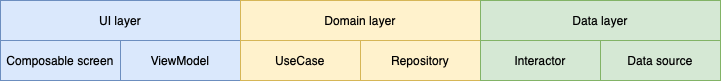

# Android Compose Coding template

# TODO Content table with links

# Introduction

## About this template

The goal of this project is to show an example application of Jetpack Compose application architecture. The project is using lots of Jetpack libraries for (mostly) UI, Kotlin Coroutines for threading,
Jupiter for tests, etc. The architecture is following Android recommended architecture (https://developer.android.com/topic/architecture) with some differences. Derivation of 3-layered architecture is
used for the project architecture (ui -> domain -> data), and MVVM pattern is used on UI layer.

Since the project is using Jetpack Compose, only some elementary UI elements will be showcased because Compose is very customizable. This project focuses more on the architecture and structure.

## Application screenshots

### Light theme

[](resources/screenshots/light_theme/light_onboarding_gif.gif)
[](resources/screenshots/light_theme/light_login.png)
[](resources/screenshots/light_theme/light_users_gif.gif)
[](resources/screenshots/light_theme/light_user.png)
[](resources/screenshots/light_theme/light_api_info_gif.gif)

### Dark theme

[](resources/screenshots/dark_theme/dark_onboarding_gif.gif)
[](resources/screenshots/dark_theme/dark_login.png)
[](resources/screenshots/dark_theme/dark_users_gif.gif)
[](resources/screenshots/dark_theme/dark_user.png)
[](resources/screenshots/dark_theme/dark_api_info_gif.gif)

### Webview

[](resources/screenshots/webview.png)

# How to build the project

In order to build the project follow steps below:

1. Clone this project to your machine and open the project in Android Studio (_required AS version 4.2+_)
2. Run this project using Android Studio

# How to customize this project for your application

This project is a template and can be used to develop new applications. In order to customize the project for your needs you will need to:

1. Clone the project to your repository (`main` branch), create new `develop` branch and continue working on it
2. Set-up environment product flavors inside app `build.gradle.kts` (usually dev/test/prod)
3. Create keystore (**with secure and random password**, e.g. use `pwgen -s 16 2`), set-up signing configs inside app `build.gradle.kts` (separate keystore for debug/release) [1]
4. Edit README.md to match the new project description and include release notes inside
5. Edit proguard rules if needed
6. **TODO** tests, CLI
7. Create MR from `develop` to `main` and assign someone to it

[1]: **WARNING:** Securely store keystore passwords locally. Additionally, send keystore file with passwords to someone from the team via encrypted zip (send encrypted zip file via one communication
channel, and password for the encrypted zip file via different communication channel - e.g. file via mail and password of the zip via MS Teams).

# Project folder (package) structure

This project uses mix of _package by feature_ and _package by layer_ structure. _Package by feature_ is used in the UI layer `ui` subpackage, and _package by layer_ is used everywhere else. This means
that:

- `ui` subpackage of the UI layer will have items that are related to a specific feature placed closely together (common items are placed to a common package)
- rest of the UI layer, data layer, and domain layer will group classed (such as use cases, repositories, interactors, etc.) in same subpackages by their functions (use cases in one subpackage,
  repositories in another, etc.)

## UI layer example

The `ui` package will contain subpackages logically separated (`prelogin`/`postlogin`/`common`) and named after features (`feature1`, `feature2`, etc.).

```
.
|-- ui
|   |-- ...
|   |-- common
|   |   |-- ...
|   |-- postlogin
|   |   |-- feature1
|   |   |   |-- component
|   |   |   |   |-- UiComponent.kt
|   |   |   |-- model
|   |   |   |   |-- SpecificFeature1UiModel.kt
|   |   |   |-- Feature1Screen.kt
|   |   |   |-- Feature1ViewModel.kt
|   |-- prelogin
|   |   |-- feature2
|   |   |   |-- Feature2Screen.kt
|   |   |   |-- Feature2ViewModel.kt
```

**Each `feature` subpackage will contain:**

- `FeatureScreen.kt` (root-level screen composable function)
- `FeatureViewModel.kt` (ViewModel of the screen)
- _Optional_ subpackage `model` (contains screen-specific UI models)
- _Optional_ subpackage `component` (contains smaller UI components - composable functions)
- Other feature related items

`common` subpackage will contain all the UI elements that are common to multiple features.

## Domain layer example

Other (non-`ui`) layers will contain functionally similar items together. This means that all repositories will be held in one subpackage, all mapper in another, all use cases in third, and so on. The
structure is the same for data layer where e.g. interceptors are grouped together in the same package, remote data sources together, exceptions together, etc.

```
.
|-- domain
|   |-- mapper
|   |   |-- Model1Mapper.kt
|   |   |-- impl
|   |   |   |-- Model1MapperImpl.kt
|   |-- model
|   |   |-- Model1.kt
|   |   |-- Model2.kt
|   |   |-- Model3.kt
|   |-- repository
|   |   |-- Repository1.kt
|   |   |-- impl
|   |   |   |-- Repository1Impl.kt
|   |-- usecase
|   |   |-- UseCase1.kt
|   |   |-- impl
|   |   |   |-- UseCase1Impl.kt
```

# 3-layered architecture

This project is layered into 3 layers (modules): UI (app module), Domain (domain module), and Data (data module). More details can be found
in [referenced architecture.](https://infinum.com/handbook/android/project-architecture/mobile-app-architecture)



## MVVM

Model–View–ViewModel (MVVM) is a software architectural pattern that facilitates the separation of the development of the graphical user interface (the view) – be it via a markup language or GUI code
– from the development of the business logic or back-end logic (the model) so that the view is not dependent on any specific model platform. (
reference: https://en.wikipedia.org/wiki/Model–view–viewmodel)
The goal of MVVM is to separate business logic of the UI (UI state, use cases, etc.) from the UI rendering itself. Goal of each element from MVVM is as follows:

- **Model**: Domain model object that represents some set of data that will be presented on the screen.
- **View**: Rendering of the models based on their member variable values.
- **ViewModel**: Class that is a state holder for the UI (screen). VM will contain states, and react to events. MV will also help with state preservation through device configuration changes (screen
  rotation, language change, process death). MV is responsible for communication between the user (UI) and data providers (API, database, shared prefs, etc.).


## UI layer

The UI layer consists of Screens (@Composable functions), and their corresponding ViewModels. Models that enter this layer are domain models containing minimal set of arguments that are required to
render the screen. Screen will render model states collected from ViewModel, and ViewModel will react to events from Screen. All of the business logic will be moved from Screen to the ViewModel. This
architecture in the UI layer is the MVVM architecture.

### Composable screen (View)

Composable screens are Composable functions representing screens (pure UI design). Screen composable is the highest-level composable of a specific screen. Usually screen will consist of couple of
components where each of these components is extracted to lower-level composable functions. Every component can then be extracted to even lower-leveled composable functions. The goal is to extract
every little component to a separate composable function and to raise re-usability. New UI components are then composed from already existing components if they exist.

- [Learn basics about compose UI toolkit](https://developer.android.com/jetpack/compose/mental-model)
- [Learn about state management in compose](https://developer.android.com/jetpack/compose/state)
- [Learn how composable functions work](https://developer.android.com/jetpack/compose/lifecycle)
- [Learn about side-effects that can cause many bugs](https://developer.android.com/jetpack/compose/side-effects)

_NOTE: If you haven't work with Jetpack Compose, I recommend you to read a little bit about Jetpack Compose before diving-into this project since it will be useful for you to know how composable
functions work and behave._

#### [Example](app/src/main/kotlin/hr/asee/android/template/compose/ui/postlogin/userinfo/UserInfoScreen.kt)

```kotlin
// UserInfoScreen is the highest-level composable for this particular screen, a.k.a. root-level screen composable
// ViewModel will be used in root-level screen composable to collect states and handle UI events
@Composable
fun UserInfoScreen(viewModel: UserInfoViewModel = hiltViewModel()) {

    // States are collected (observed) in root-level screen composable to conform state-hoisting principle (reference 1)
    val userDetailsState by viewModel.userDetails.collectAsState()
    val uiState by viewModel.uiState.collectAsState()

    // Based on the UI state, emit different composable functions, each representing a state of the screen
    // Whenever a state changes in the ViewModel, it will also be refreshed in composable function
    // This also means that recomposition of the screen will be invoked and UI will change based on the state change
    when (uiState) {
        is UiState.Error -> UserInfoErrorContent(uiState = uiState as UiState.Error)
        UiState.Loading -> LoadingScreenLayout()
        UiState.Success -> userDetailsState.userDetails?.let {
            UserInfoRootContent(
                user = it.user,
                onBackClicked = viewModel::goBack,
                onLinkClicked = viewModel::openInfoUrl,
            )
        }
        is UiState.Info, UiState.None -> {
            // NO-OP
        }
    }
}
```

- [reference 1](https://developer.android.com/jetpack/compose/state#state-hoisting) - state hoisting

### ViewModel

ViewModel is a state holder class that is aware of the applications lifecycle. It is the **single source of truth**. ViewModel will contain states of (domain or UI-specific) models such as UI widgets,
lists of data, etc. which are then collected (observed) in the composable screens, and rendered on the screen. This is done by passing states to lower-leveled composable functions where these states
are dynamically used in composable components. ViewModel will also handle events coming from the composable screens, call use cases, etc.

Basically, ViewModel will be responsible for all of the UI business logic. ViewModel will change component states that are collected (observed) in the composable functions and rendered on the UI.
Composable functions are therefore reactive because every change of the state in ViewModel will cause a change on the UI that user will be able to see. Events happening on the UI (such as click) will
be passed (by lambda functions) all the way up to the ViewModel, and ViewModel will handle them.

- Read more about ViewModels [here](https://developer.android.com/jetpack/compose/state#viewmodels-source-of-truth) (read whole _Managing state_ section to learn more about composable functions and
  state of their components)

#### [Example](app/src/main/kotlin/hr/asee/android/template/compose/ui/postlogin/userinfo/UserInfoViewModel.kt)

```kotlin
// HiltViewModel states that this ViewModel can be created by Hilt
@HiltViewModel
class UserInfoViewModel @Inject constructor(
    // Use case is injected with Hilt
    private val getUserUseCase: GetUserUseCase,
    // Every ViewModel will extend BaseViewModel where common functionality is implemented.
) : BaseViewModel() {

    // User details state consists of mutable internal state, and immutable exposed public state
    private val _userDetails = MutableStateFlow(UserDetailsState())
    val userDetails: StateFlow<UserDetailsState> = _userDetails

    // When ViewModel is initialized, initialize user details state that will be rendered on the screen
    init {
        // Use cases will almost always be suspend functions because coroutines are used
        // This means that use cases must be called from a coroutine scope
        viewModelScope.launch {
            // In real-life scenario, userId is obtained from savedInstanceState (passed via navigation argument)
            initUser(123)
        }
    }

    // This method is suspend because it will invoke use case
    private suspend fun initUser(userId: Int) {
        // Create a request for the use case
        val request = GetUserUseCase.GetUserRequest(userId = userId)

        // Invoke the use case
        getUserUseCase(request).onFinished(
            successCallback = this::getUserSuccess,
            errorCallback = this::getUserError,
        )
    }

    private fun getUserSuccess(userDetails: UserDetails) {
        _userDetails.update { it.copy(userDetails = userDetails) }
        showSuccess()
    }

    private fun getUserError() {
        showError()
    }

    // Rest of the code...
}
```

## Domain layer

The domain layer has a job of preparing data for the UI layer. This means that input to the domain layer are data models (API models, DB models, etc.). Then, some logic is applied to data models, they
are mapped to the domain models, and outputted from the data layer to the UI layer. Underlying data implementation is abstracted from the UI layer via the domain layer. This means that for example:
changing data source from one API to another should not affect the UI layer since domain layer will always do all the necessary logic to map data models to the same domain models that are expected in
the UI layer.

### UseCase

Use case is a simple class that will usually inject and use repositories, get and combine some data, and return it to the UI layer. Use case is responsible for passing the data from the domain layer
to the UI layer. Use case will focus on business logic, such as combining multiple data models into one.

#### [Example](domain/src/main/kotlin/hr/asee/android/template/domain/usecase/impl/LoginUseCaseImpl.kt)

```kotlin
class LoginUseCaseImpl(
    // Use case will inject one or more repositories
    private val authenticationRepository: AuthenticationRepository,
) : LoginUseCase {

    // Use case contains business logic, and returns the result back to the UI layer
    // Use case will catch all possible errors and return them to the UI layer
    override suspend fun invoke(request: LoginUseCase.LoginRequest): EmptyResource {
        val token = try {
            authenticationRepository.login(email = request.email, password = request.password)

        } catch (missingPasswordException: MissingPasswordException) {
            return Resource.Error(LoginUseCase.LoginError.MISSING_PASSWORD_ERROR, missingPasswordException)

        } catch (userNotFoundException: UserNotFoundException) {
            return Resource.Error(LoginUseCase.LoginError.USER_NOT_FOUND_ERROR, userNotFoundException)

        } catch (missingEmailOrUsernameException: MissingEmailOrUsernameException) {
            return Resource.Error(LoginUseCase.LoginError.MISSING_EMAIL_OR_USERNAME_ERROR, missingEmailOrUsernameException)

        } catch (throwable: Throwable) {
            return Resource.Error(LoginUseCase.LoginError.GENERAL_LOGIN_ERROR, throwable)
        }

        try {
            authenticationRepository.storeAccessToken(token)
        } catch (throwable: Throwable) {
            return Resource.Error(LoginUseCase.LoginError.STORE_ACCESS_TOKEN_ERROR, throwable)
        }

        return Resource.Success.empty()
    }
}
```

### Repository

- [Repository pattern](https://java-design-patterns.com/patterns/repository/)

Repository is a class that will usually inject and use interactors from data layer. It will get some data (through interactors) and map, filter, or modify data in some other way, and pass it to the
use case. This is the sub-layer where mapping of data models to domain models is done. Repository will also know what data sources (interactors) to use (e.g. local SQLite source, remote API source,
some other remote API source) and what those data sources return.

#### [Example](domain/src/main/kotlin/hr/asee/android/template/domain/repository/impl/AuthenticationRepositoryImpl.kt)

```kotlin
// Repository will inject interactors and mappers
class AuthenticationRepositoryImpl(
    private val loginInteractor: LoginInteractor,
    private val accessTokenMapper: AccessTokenMapper,
) : AuthenticationRepository {

    // Repository is responsible for mapping data models to domain models
    override suspend fun login(email: String, password: String): AccessToken {
        return accessTokenMapper.toAccessToken(loginInteractor(ApiLoginRequest(email = email, password = password)))
    }
}
```

## Data layer

The data layer will provide all the actual data that will be processed by the domain layer, and then passed to the UI layer. The data layer will contain remote and local data sources such as API,
database, shared preferences, etc. Models in data layer are unprocessed and passed to the domain layer intact. Each data source kind will have its own models so if anything changes on one side, it
doesn't affect the other.

### Interactor

Interactor is a component that will abstract the data source underneath. This component should contain no logic at all other than fetching/getting of the data in their _raw_ form (data models).

#### [Example](data/src/main/kotlin/hr/asee/android/template/data/interactor/impl/GetUserInteractorImpl.kt)

```kotlin
// Interactors will inject instances such as Retrofit API service, database DAO, etc.
class GetUserInteractorImpl(private val reqresApiService: ReqresApiService) : GetUserInteractor {

    override suspend fun invoke(userId: Int): ApiGetUserResponse {
        return reqresApiService.getUser(userId)
    }
}
```

### Data source

Data source is a component that will connect the application with a real-life data service provider. This will be API, database file, etc. This component usually consists of Retrofit API service
interfaces, Room database DAOs, datastore storage, shared preferences, etc.

#### [Example](data/src/main/kotlin/hr/asee/android/template/data/network/ReqresApiService.kt)

```kotlin
// This is an example of Retrofit API service
interface ReqresApiService {

    @POST("/api/login")
    suspend fun login(
        @Body request: ApiLoginRequest,
    ): ApiAccessToken
}
```

# GitLab CI

GitLab CI is configured through `.gitlab-ci.yml` file and defines a pipeline that will be triggered on each Merge Request (MR) creation. The pipeline will also be triggered on each commit of the
opened MR.

The pipeline is configured in 2 stages:

- `build` stage
- `test` stage

## `build` stage

Build stage consists of only a single job: `build`.

`build` job will build the application (all flavors and build types) and collect built apk's in an archive that is available for download after the job is finished.

## `test` stage

Test stage consists of 2 custom jobs, and 2 jobs included via [GitLab template](https://gitlab.com/gitlab-org/gitlab/-/tree/master/lib/gitlab/ci/templates). Those are:

- _Custom jobs:_
    - `test`
    - `mobsfscan-custom`
- _Jobs from included templates:_
    - `mobsf-android-sast` (SAST - static application security testing)
    - `secret_detection` (security analysis)

### `test` job

This job will build the application, run all unit tests, and collect test results in an archive that is available for download after the job is done. Test results will also be shown in GitLab web
application (git.asseco-see.hr) in pipeline and MR details.

### `mobsfscan-custom` job

This job will perform [MOBSFScan](https://github.com/MobSF/mobsfscan) security analysis (SAST) without additional rules. Analysis results are available for download in an archive after the job is
successfully finished.

Because there are no rules defined for the analysis, analysis result will probably consist of fake positive vulnerabilities, so this job should either be configured to use some rules, or the results
should be taken with a grain of salt and analysed manually.

### `mobsf-android-sast` job

This job comes from [`Security/SAST.gitlab-ci.yml` template](https://gitlab.com/gitlab-org/gitlab/-/blob/master/lib/gitlab/ci/templates/Security/SAST.gitlab-ci.yml) and is configured following the
[GitHub CI SAST analysis](https://docs.gitlab.com/ee/user/application_security/sast/). The job will perform security analysis (SAST) and output results in an archive that is available for download
after the job successfully finishes.

### `secret_detection` job

This job will perform [secret detection](https://docs.gitlab.com/ee/user/application_security/secret_detection/) which will look for secrets that are accidentally committed to the git repository.
Result of the analysis is available for download after the job successfully finishes.

# OPTIONAL: SonarQube

## About

SonarQube (formerly Sonar) is an open-source platform developed by SonarSource for continuous inspection of code quality to perform automatic reviews with static analysis of code to detect bugs, code
smells on 17 programming languages. SonarQube offers reports on duplicated code, coding standards, unit tests, code coverage, code complexity, comments, bugs, and security
recommendations[[1]](https://en.wikipedia.org/wiki/SonarQube).

You can set-up SonarQube instance locally on your machine and run code inspection tools with custom (or default) configuration. Basically, you will need to download and run a script that will run a
server of SonarQube instance. When the server is running, web application is available where you can tweak all the settings, configurations, etc. You will also configure your project on the web
application.

## Set-up instructions

This section will only provide general steps you have to do in order to set-up the SonarQube instance. For details, check external references.

1. Download [SonarQube Community Edition](https://www.sonarqube.org/downloads/) and [SonarQube scanner](https://docs.sonarqube.org/latest/analysis/scan/sonarscanner/). Extract the archives to the same
   folder.
2. Add _bin_ folders (from the extracted archives) to _PATH_ environmental variable (Mac OS - .bashrc/.zshrc/etc., Windows - setup environmental variable)
    1. When setting up SonarQube on Mac OS, the export command will look like
       following: `export PATH=~/Desktop/sonarqube/sonar-scanner-4.7.0.2747-macosx/bin:~/Desktop/sonarqube/sonarqube-9.4.0.54424/bin/macosx-universal-64:$PATH%`.
3. Run sonar.sh (for Mac OS*) or sonar.bat (for Windows).
4. Open web browser and browse for `http://localhost:9000`. This should open up the SonarQube web application.
    1. Log in to the web application (you will have to set up new password the first time)
    2. Create manual project
    3. Select option to create local project
    4. Choose gradle plugin and follow the instructions for the rest of the configuration

[*] When running sonar.sh on Mac OS you will have to give permission by navigating to _Security & Privacy_ -> _General_. Under section _Allow apps downloaded from:_ find a button _Open anyways_, run
the sonar.sh again.

_NOTE: Helpful command that will run SonarQube analysis on the Android project when ran from Android Studio terminal instance:_
`./gradlew sonarqube \ `\
`-Dsonar.projectKey=Test \ `\
`-Dsonar.host.url=http://localhost:9000 \ `\
`-Dsonar.login=736d73112a2c5942367e445aef535842b316ff5b \ `\
`-Dsonar.sources=.`

# Useful external references

## Jetpack compose

- [Jetpack Compose documentation](https://developer.android.com/jetpack/compose/documentation)
- [Jetpack Compose basics codelab](https://developer.android.com/codelabs/jetpack-compose-basics#0)
- [Jetpack Compose architecture](https://developer.android.com/jetpack/compose/architecture)
- [Jetpack Compose basics tutorial](https://developer.android.com/jetpack/compose/tutorial)
- [Jetpack Compose interoperability with other libraries](https://developer.android.com/jetpack/compose/libraries)

## App architecture

- [Android guide to app architecture](https://developer.android.com/topic/architecture)
- [Infinum handbook - Mobile app architecture](https://infinum.com/handbook/android/project-architecture/mobile-app-architecture)
- [Infinum handbook - Unit tests](https://infinum.com/handbook/android/building-quality-apps/unit-tests)

## SonarQube

- [Get started with SonarQube in two minutes (Windows)](https://docs.sonarqube.org/7.4/setup/get-started-2-minutes/)
- [Install SonarQube on Mac OS - Medium article](https://medium.com/mobiosolutions/install-sonarqube-installation-guide-for-mac-os-mobio-solutions-5fb0795f2d0b)
